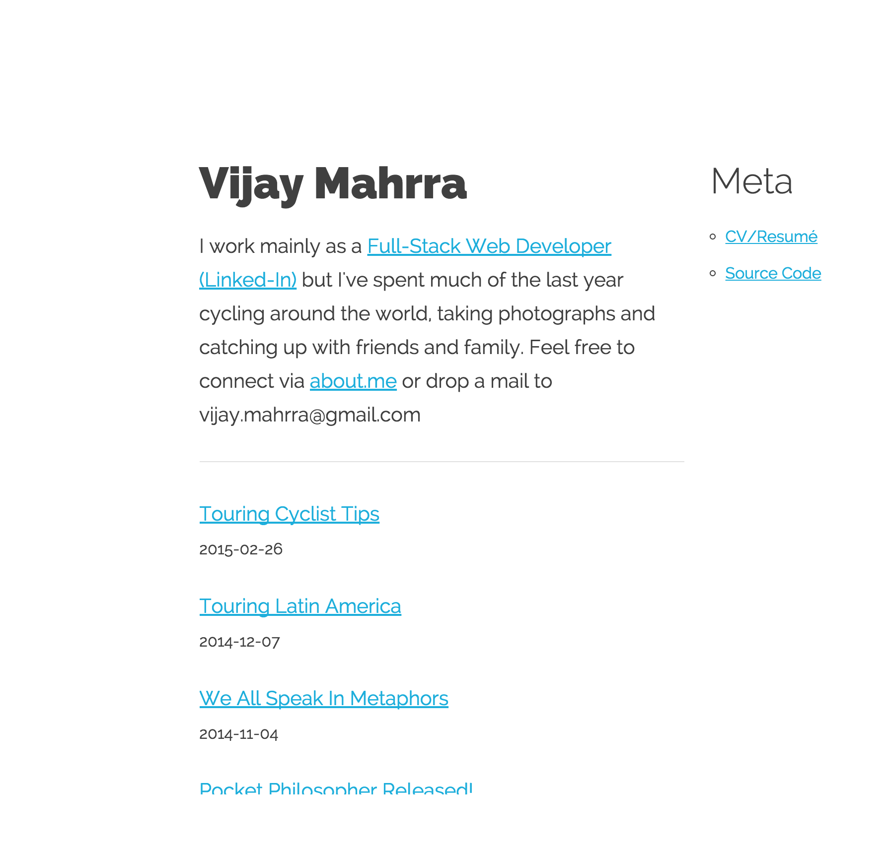

# Beautifully Simple Static [Bottle](http://bottlepy.org/) Blog Generator



## Features

* Can run dynamically serving files via WSCGI or generate a static site from the files
* No database required
* Uses [Waitress WSCGI Server](http://docs.pylonsproject.org/projects/waitress/en/latest/index.html): it is pure-Python, standard library only, cross-platform, deployment-oriented, production-quality.
* Generated HTML, JS and CSS is optionally minified and saved 
* Supports in-line concatenation and embedding of javascript and CSS files.
* Caching, minification and static files can be disabled if needed
* JS files in [/www/js/](www/js) optionally minified to [/blog/js/](/blog/js/)
* CSS files in [/www/css/](www/css) optionally minified to [/blog/css/](/blog/css/)
* Generates static from [markdown](https://guides.github.com/features/mastering-markdown/) files in `content` and `docs` folders under [www/blog/](www/blog) by default
* Mobile-first, responsive design
* RSS feed generated at `www/blog/rss.xml` and referenced in [robots.txt](www/robots.txt) to generate sitemap for blogs.
* Python3-compatible - using [Python Future](http://python-future.org/quickstart.html#installation) and [2to3](https://docs.python.org/2/library/2to3.html)

## Easy Setup

* `pip install -r requirements.txt`
* Copy config file: `cp config.py.example config.py` - this is done automatically the first time [app.py](app.py) is run if the [config.py](config.py.example) file does not exist
* Edit `config.py` as needed

## Running

* `python app.py` 
* Browse the website at [http://localhost:8080](http://localhost:8080/)

All the .html files are generated at startup in the [www/blog](www/blog) and [www/blog/docs](www/blog/docs) folders.  
The files in [www](www/) can then be synchronised with your website using a tool like [rsync](http://en.wikipedia.org/wiki/Rsync)

## Why?
Because there aren't enough static website generators already in existence that 
look beautiful. 

This is one I created for [my personal blog](http://www.urunu.com)
to learn how to build a Python website from scratch.  It's a bit of a hack but
it does the job perfectly for my needs. For simplicity and ease-of-learning, 
and following the single-file Bottle design, all of the main web code lives in one
file, [app.py](app.py) 

Check the [TODO.md](docs/TODO.md) or [ROADMAP.md](docs/ROADMAP.md) 
to see what's left to do and if you make some [CHANGES.md](docs/CHANGES.md) I'll be
sure to add you to the [CREDITS.md](docs/CREDITS.md) and [humans.txt](www/humans.txt) files.

## Example Blog Post
Put markdown files in the folder [content/](content/) ensuring that your markdown files use a content header:

e.g. `content/2015-12-25-xmas.md` - be sure to use the meta information header on each file as shown below

```
---
date: 2015-04-01 12:56
title: Emil Cioran Quote
tags: [emil cioran, cioran, philosophy, quotes]
---
"I have all the defects of other people, and yet everything they do seems to me inconceivable."
Emil Cioran
```

### Theming and Customisation

* Change the [views](views/) .tpl files as needed for your website
* Docs for 'Meta' information on the right column are generated from the files in [docs/](docs) folder.
* Error 404 File Not Found page: [www/error/404.html](www/error/404.html) - see [www/.htaccess](www/.htaccess) file for how to use with apache.
* Edit the css in [www/css/](www/css/)
* Edit the javascript in [www/js/](www/js/)
* Put images in [www/img/](www/img/)
* Favourite icons: [www/favicon.ico](www/favicon.ico) and [www/img/favicon.png](www/img/favicon.png)
* Don't forget to update [www/humans.txt](www/humans.txt)!

### config.py explained
Config.data is a dict() of the following configuration values:
```
    'debug': False,                   # debug mode
    'generate': True,                 # generate static website files
    'minify_css': True,               # minify css served by webserver (not static files)
    'minify_js': True,                # minify javascript served by webserver (not static files)
    'minify_html': True,              # minify all output html including static files
    'cache': True,                    # cache files and output of app
    'cache_dir': 'tmp/cache',         # default location of cached files
    'content_dir': 'content',         # default location of .md blog content files
    'docs_dir': 'docs',               # default location for non-blog .md files
    'www_root': 'www',                # default location of website root directory
    'output_dir': 'www/blog',         # default location of webroot for blog
    'js_dir': 'www/js',               # default location of javascript files
    'js_output': 'www/blog/js',       # minified js output directory
    'js_inline': []                   # inline js to compile into page (default:footer) <script>
    'css_dir': 'www/css',             # default location of css files
    'css_output': 'www/blog/css',     # minified js output directory
    'css_inline': ["normalize.css", "skeleton.css"] # inline css to compile into page  (default:header) <style>
    'ga_code': 'UA-00000000-1',       # google analytics code UA-XXXX-Y
    'title': 'Blog',                  # name of the blog
    'author': 'Anonymous',            # author of the blog
    'email': 'anonymous@example.com', # email of author
    'url': 'http://www.example.com'   # canonical website url
```

### Command Line Interface
* The file [manage.py](manage.py) is implemented using [click](http://click.pocoo.org/4/) (TO BE DONE!)

## Documentation

* Everything's in the [docs/](docs/) folder.
